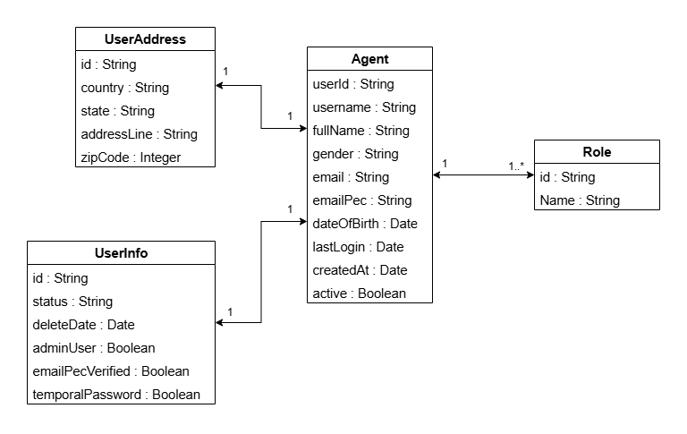

# Agent Management Application - Documentation

## Dépendances utilisées

- **Spring Web** : Framework web pour les APIs REST
- **Spring Data JPA** : Couche d'accès aux données
- **PostgreSQL Driver** : Driver pour la base de données PostgreSQL
- **Lombok** : Réduction du code boilerplate
- **Validation** : Validation des données d'entrée
- **Spring Boot DevTools** : Outils de développement

## Structure du Projet

```text
src/main/java/com/example/agents/
├── controller/
│   └── AgentController.java
├── model/
│   ├── Agent.java
│   ├── Role.java
│   ├── UserInfo.java
│   └── UserAddress.java
├── repository/
│   └── AgentRepository.java
├── service/
│   └── AgentService.java
├── util/
│   └── UserIdGenerator.java
└── AgentManagementApplication.java
```

## Diagramme de classes



- Un Agent peut avoir plusieurs rôles.
- Chaque Agent possède une seule fiche d’informations (UserInfo).
- Chaque Agent possède une seule adresse (UserAddress).

### Tests avec Postman

#### Collection des APIs testées


APIs REST - Endpoints :

| Méthode  | Endpoint                 | Description                            |
| -------- | ------------------------ | -------------------------------------- |
| `GET`    | `/api/v1/agents`         | Récupère la liste de tous les agents   |
| `POST`   | `/api/v1/agent`          | Ajoute un nouvel agent                 |
| `GET`    | `/api/v1/agent/{userId}` | Récupère un agent par son ID           |
| `PUT`    | `/api/v1/agent/{userId}` | Met à jour les informations d'un agent |
| `DELETE` | `/api/v1/agent/{userId}` | Supprime un agent                      |
| `GET`    | `/api/v1/agents/active`  | Récupère les agents actifs             |

#### Ajouter un nouvel agent


#### Récupérer tous les agents


#### Récupérer un agent par ID


#### Mettre à jour un agent


#### Supprimer un agent


#### Récupérer les agents actifs


### Base de données PostgreSQL

#### Table des agents


#### Table des rôles


#### Table des adresses utilisateurs


#### Table des informations utilisateurs


