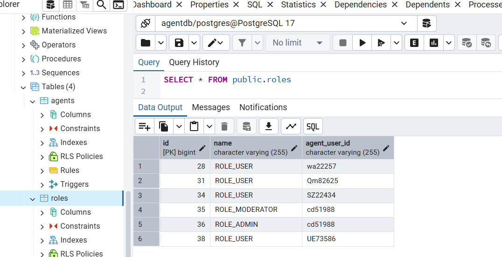

Structure du Projet :
src/main/java/com/example/agents/
├── controller/
│ └── AgentController.java
├── model/
│ ├── Agent.java
│ ├── Role.java
│ ├── UserInfo.java
│ └── UserAddress.java
├── repository/
│ └── AgentRepository.java
├── service/
│ └── AgentService.java
├── util/
│ └── UserIdGenerator.java
└── AgentManagementApplication.java

Les dépendances qui sont utilisé :
Spring Web
Spring Data JPA
PostgreSQL Driver
Lombok
Validation
Spring Boot DevTools

Diagramme de class

Capture Postman
collection of tested api

Ajoute un nouvel agent

Récupérer tous les agents

Récupérer un agent par ID

met a jour un agent

suprimer un agent

Récupère les agents actifs

Capture Postgres
base de donne de agent

exemple role

